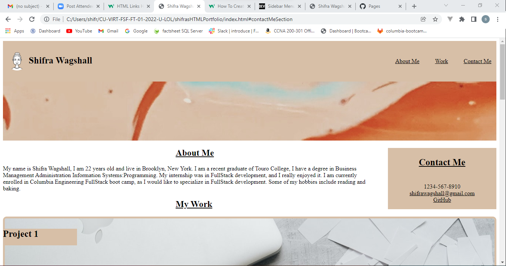
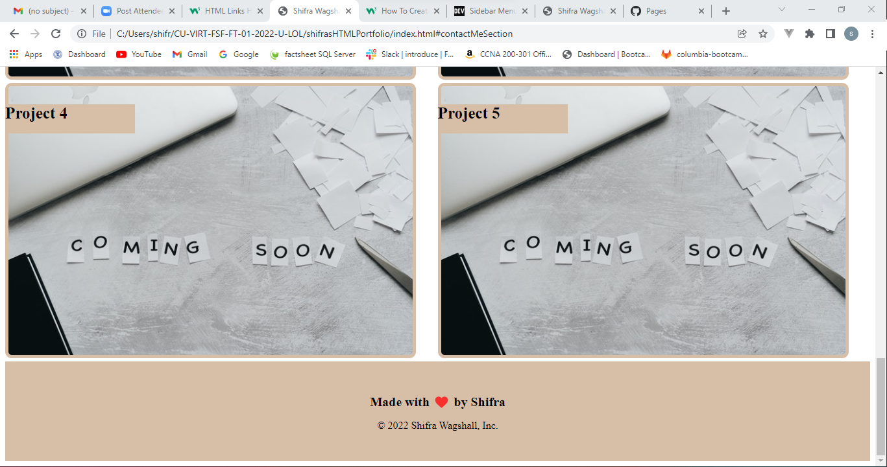

# shifrasHTMLPortfolio
hw2 
This website is a personal portfoilio to display some of my progamming projects. The website was made using only HTML and css. In the website, I tell the user a little bit about myself, and ways to contact me. I also, show 5 projects I made via and image and when the user clicks on the image they are taken to the deployed project. (For now the user is taken to google home page). The nav bar on top will bring the user to the section they click on. Also, if you resize your screen the website will adjust to fit the screen. Here is the URL for the deployed website: https://swagshall.github.io/shifrasHTMLPortfolio/

Here are images of what the website looks like: 
 
 
